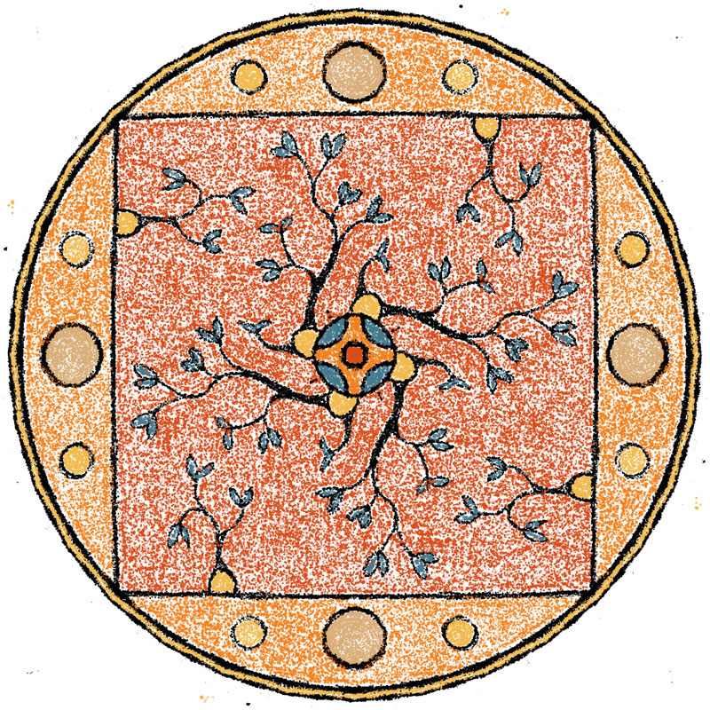

# A Mandala Maker

Inspired by an [example sketch](https://p5js.org/examples/interaction-kaleidoscope.html) on the P5.js webpage, this is a little web app that will help you get through the day by making sand mandalas. Works best on a tablet with stylus, but desktop and mouse or phone and fingers also do the trick.

## Instructions

Use the buttons on the top left to change your sand color. The buttons on the top left will change the symmetry of the drawing. The mirror checkbox enables/disables a mirror type symmetry. Find peace.

Live version: [https://hedbergj.github.io/artcode/mandala-maker/](https://hedbergj.github.io/artcode/mandala-maker/)

## Some examples:

